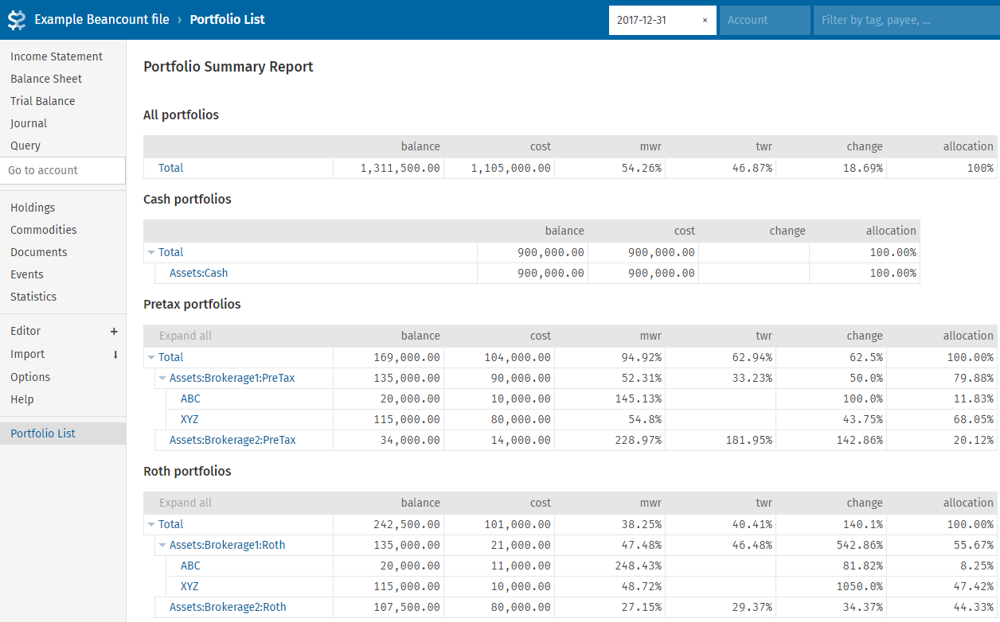

# Fava Portfolio Summary
This is a Fava extension to display a grouped portfolio view in Fava for a set of Beancount accounts.

It can also calculate MWRR (Money-Weighted Rate of Return) or TWRR (Time-Weighted Rate of Return)

The display is similar to the Balance Sheet in Fava, however it allows grouping accounts, and calculating
partial balances.

The MWRR (and especially TWRR) calculations can be very slow to calculate.  By default, MWRR is enabled, and TWRR is disabled



## Configuration
In the beancount file, configure via:
```
2000-01-01 custom "fava-extension" "portfolio_summary" "{
    'metadata-key': 'portfolio',
    'account-groups': (
        { 'name': 'cash', 'mwr': False },
        'investment',
        'retirement-pretax',
        'retirement-roth'),
    'internal': (
      '.*:PnL',
      'Income:Investments:Dividends',
      'Income:Bank:Interest'),
    'mwr': 'children',
    'twr': False,
    }"
```
  * `metadata-key`: Name of key used to group accounts
  * `account-groups`: Either a string or a dictionary with the `name` key identifying the name of the group
    * If specified as a dictionary, the `ineternal`, `mwr` and `twr` keys can be specied on a per-group basis
  * `internal` (optional): List of regex patterns denoting 'internal' accounts that should be ignored for cash-flow purposes
    during MWRR/TWRR calculation
  * `mwr` (optional): Enable MWRR calculation for all accounts (can be overridden at the group level).
    Possible values: (True, False, 'children') Defaults to *True*
  * `twr` (optional): Enable TWRR calculation for all accounts (can be overridden at the group level).
    Possible values: (True, False, 'children') Defaults to *False*

Additionally each top-level account (that is to be displayed) needs to be marked with the appropriate group:
```
2000-01-01 open Assets:Investments:Fidelity401k:PreTax
  portfolio: "retirement-pretax"
```
For each top level account, all transactions of the account and any child accounts will be considered (I.e. for the example above,
`Assets:Investments:Fidelity401k:PreTax` and any accouunt matching `Assets:Investments:Fidelity401k:PreTax:.*` will be summarized)
